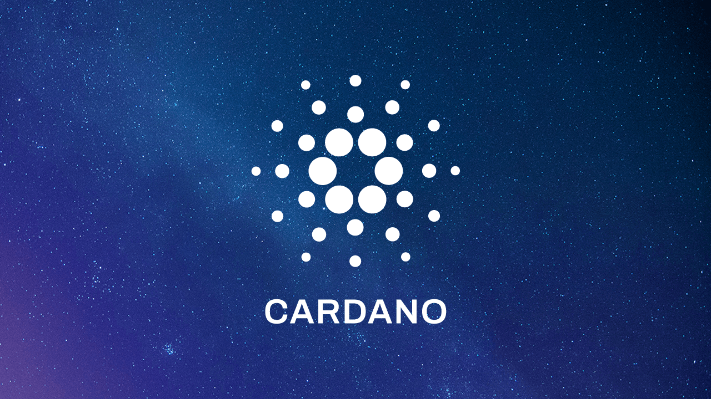
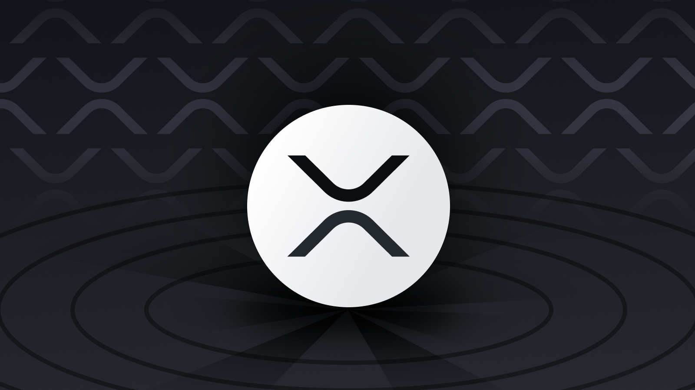
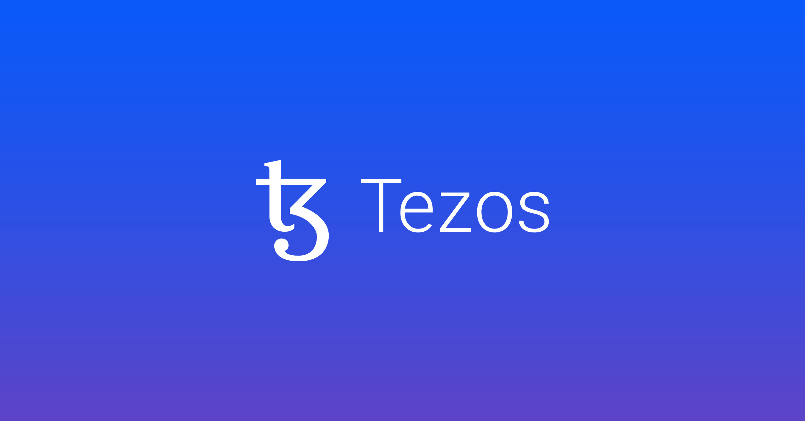
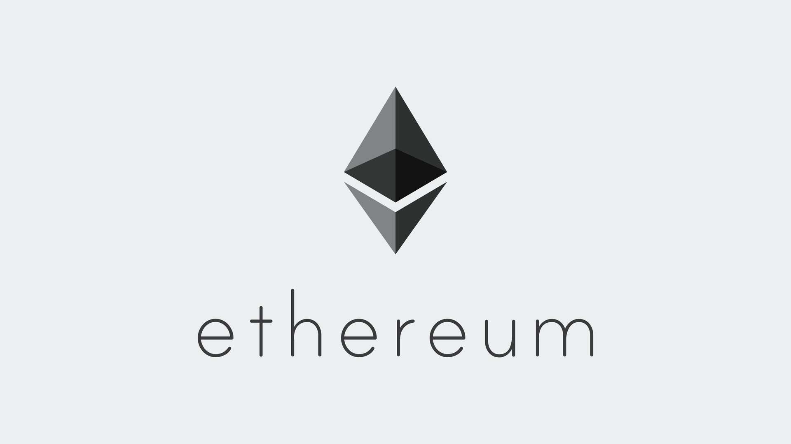
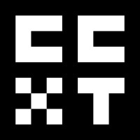

# CCDB Application

---

## ✨ Features

**CCDB**, the robust data collector, seamlessly launches collectors to acquire and archive data on chosen symbols (_markets_) from various exchanges. Experience comprehensive support for multiple data types and enhanced user-driven data retrieval within bespoke ranges. CCDB boasts a fault-tolerant distributed architecture, ensures deterministic scheduling for rate limit adherence, and integrates seamlessly with leading blockchain technologies.

### Supported Data Types
CCDB actively supports a diverse range of data types, including:

- 📚 **Order Book**: A real-time list of buy and sell orders on the exchange.
- 🔄 **Trade**: Detailed information on executed transactions.
- 🏷️ **Ticker**: Snapshot of the current market statistics.
- 🕯️ **Candlestick**: Price movement data depicted over a specific time period.
- 💹 **Exchange Rate**: Current currency conversion rates.

### Data Retrieval
- 🔍 **User-Driven Data Access**: Retrieve stored data within a user-defined range.
- 📅 **Historical Data**: Access historical data over specific time intervals.

### Architecture & Integrations

- 🏛️ **Fault-Tolerant Distributed Architecture**: Designed for resilience and continuous operation.
- ⏱️ **Deterministic Scheduling**: Smart scheduling to stay within API rate limits.
- 🔗 **Blockchain Integrations**:

| Logo | Name |
|:---:|:---|
|  | [Cardano (ADA)](https://cardano.org/) |
|  | [XRP Ledger (XRPL)](https://xrpl.org/index.html) |
|  | [Tezos (XTZ)](https://tezos.com/) |
|  | [Ethereum (ETH)](https://ethereum.org/) and DEXs |

## Documentation Links

For more details, visit the following chapters organized by category:

### Getting Started
- 🚀 [Quick Start Guide](docs/quick-start.md)
- 📐 [Structure Information](docs/structure.md)

### Configuration Guides
- ⚙️ [System Config](docs/config/system.md)

### CEX & DEX Collectors Configuration

| Logo | Name | Exchanges Type |
|:---:|:---|:---:|
|  | [CCXT Collectors Config](docs/config/ccxt-collectors.md) | CEXs |
|  | [Cardano Collectors Config](docs/config/cardano-collectors.md) | DEXs |
|  | [Ethereum Collectors Config](docs/config/eth-collectors.md) | DEXs |
|  | [Tezos Collectors Config](docs/config/tezos-collectors.md) | DEXs |
|  | [XRP Ledger Collectors Config](docs/config/xrpl-collectors.md) | DEXs |

