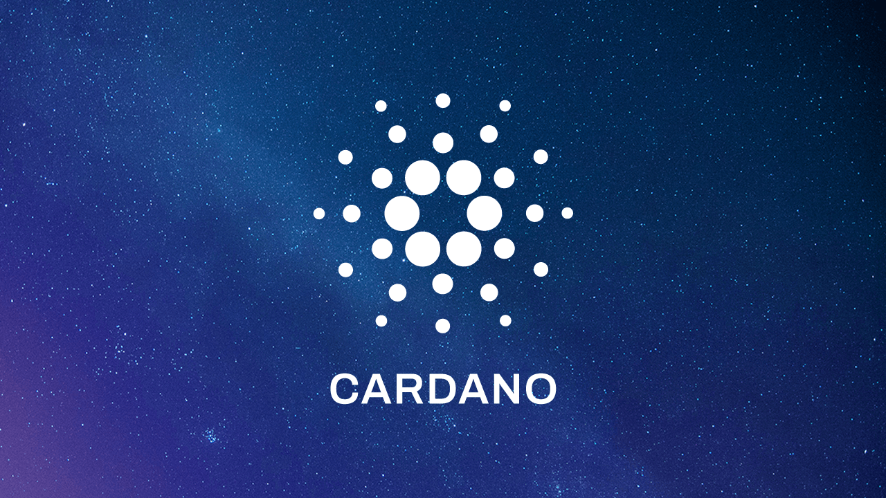
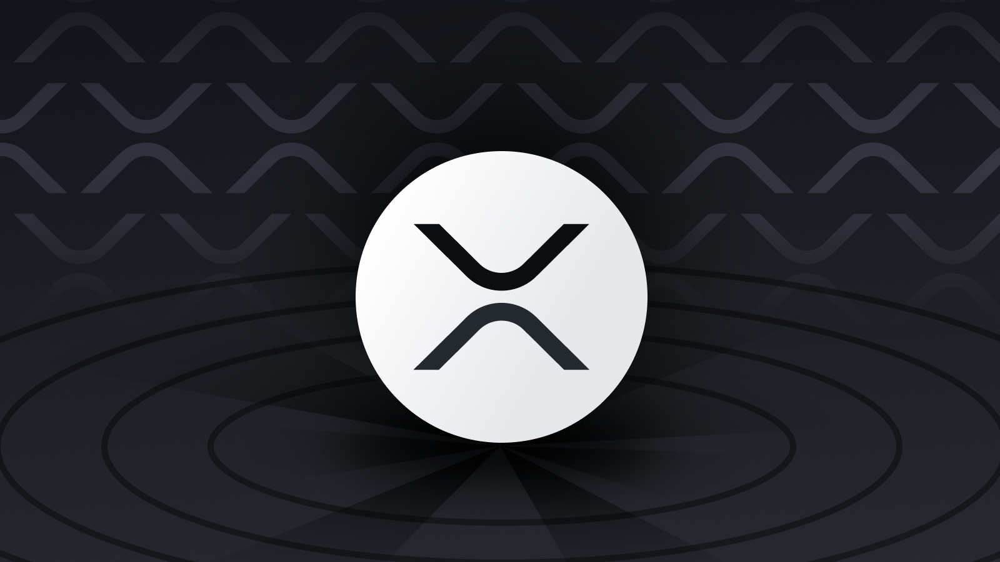
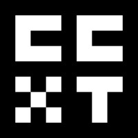

# CCDB Application

## Table of Contents

[**Introduction**](#introduction) · [**Principles**](#foundational-principles) · [**Objectives**](#objectives) · [**Features**](#features) · [**Use Cases**](#use-cases) · [**Data Types**](#supported-data-types) · [**Data Retrieval**](#data-retrieval) · [**Architecture**](#architecture) · [**Getting Started**](#getting-started) · [**Config Guides**](#configuration-guides) · [**Community Contribution Guides**](#community-contribution-guides) · [**Glossary**](#glossary)

## Introduction
Welcome to the CCDB* Application, a robust and comprehensive data collector designed for seamless integration with various exchanges and blockchain technologies. This document is a gateway to understanding our application, from its core principles and objectives to its technical configurations. *Note: We don't really have a catchy name for the project yet, so for now, we just call it "CCDB," short for "Cryptocurrency Database."

## Foundational Principles

| Principles   | Description |
|--------------|-------------|
| **Openness** | We commit to transparency and believe in sharing our work with the community to foster innovation and collaboration. |
| **Collaboration** | Collaboration is at the heart of our project. We welcome contributions from all individuals and strive to build a supportive open-source community. |
| **Inclusivity** | We embrace diversity and aim to create an inclusive environment where everyone is encouraged to contribute and participate. |
| **Quality** | Quality is paramount. We are dedicated to delivering high-quality software with a focus on reliability and user-friendliness. |
| **Empowerment** | We empower our community by encouraging ownership and recognizing the contributions that help us grow and improve. |

## Objectives

| Objectives   | Description |
|--------------|-------------|
| **Community Engagement** | To build and nurture a community that values each member's contributions and fosters a collaborative spirit. |
| **Excellence in Software** | To develop reliable and user-friendly open-source software that meets the highest standards of quality and innovation. |
| **Innovation and Research** | To pursue cutting-edge solutions and explore new technologies that advance the project and benefit users. |
| **Project Sustainability** | To create a robust, sustainable open-source project with a clear roadmap for long-term success. |
| **Community Benefit** | To contribute to the broader open-source community and provide educational resources on open-source development and collaboration. |

## Features
**CCDB** is a robust data collector that seamlessly launches collectors to acquire and archive data on chosen symbols (_markets_) from various exchanges. It offers:

- Comprehensive support for multiple data types.
- Enhanced user-driven data retrieval.
- Fault-tolerant distributed architecture.
- Deterministic scheduling for rate limit adherence.
- Seamless integration with leading blockchain technologies.

## Use Cases

### **Overview**

Our server's core functionality revolves around emitting real-time pricing events for various data types such as **Order Books, Tickers, Trades, Candlesticks, and Exchange Rates** in liquidity pools. This data, captured for each configured currency pair, is fetched and stored in our database by sophisticated collectors. In this section, we delve into a specific use cases leveraging our server's WebSocket and REST API to create a streamlined, real-time solutions.

### **Use Case: Real-Time Streaming Dashboard via Websocket API**

#### Scenario

The objective is to develop a dashboard that displays **up-to-the-minute market data** for selected cryptocurrency pairs, leveraging the power of our WebSocket API for real-time data streaming.

#### Target Pairs

The dashboard will feature real-time updates for the following pairs:

- `ADA-BTC` (Cardano to Bitcoin)
- `XRP-BTC` (Ripple to Bitcoin)
- `XTZ-BTC` (Tezos to Bitcoin)
- `ETH-BTC` (Ethereum to Bitcoin)
- `BTC-USD` (Bitcoin to US Dollar)

#### Features

1. **Real-Time Data Streaming:** Instantaneous updates as our server emits pricing events, ensuring a live feed with no need for manual refresh.
   
2. **Multiple Data Types Display:** Showcasing Order Book depths, latest Trades, Ticker information, Candlestick charts, and Exchange Rates.

3. **Customizable Views:** Users can select which pairs to display and customize settings for each data type.

4. **High Performance and Scalability:** Optimized for handling high-frequency data with minimal latency.

5. **User-Friendly Interface:** Easy-to-navigate design for efficient monitoring of different pairs and data types.

#### Implementation

Utilizing web technologies compatible with WebSocket connections, the dashboard will subscribe to our server's feeds for the specified pairs, updating the display in real-time as new data arrives.

## Supported Data Types
CCDB supports a diverse range of data types:

- 📚 **Order Book**: Real-time buy and sell orders.
- 🔄 **Trade**: Information on executed transactions.
- 🏷️ **Ticker**: Current market statistics.
- 🕯️ **Candlestick**: Price movement over time.
- 💹 **Exchange Rate**: Current currency conversion rates.

## Data Retrieval
- 🔍 **User-Driven Data Access**: Data retrieval within user-defined ranges.
- 📅 **Historical Data**: Access to data over specific time intervals.

## Architecture
- 🏛️ **Distributed Architecture**: Ensures resilience and continuous operation.
- ⏱️ **Scheduling**: Maintains API rate limits.
- 🔗 **Blockchain Integrations**:
  
  | Blockchain | Integration |
  |:----------|:------------|
  |  | [Cardano (ADA)](https://cardano.org/) |
  |  | [XRP Ledger (XRPL)](https://xrpl.org/index.html) |
  |  | [Tezos (XTZ)](https://tezos.com/) |
  |  | [Ethereum (ETH)](https://ethereum.org/) |

- 📗 [Architecture Documentation](docs/architecture/overview.md)
- 📒 [Codebase Structure Docs](docs/codebase/overview.md)

## Getting Started
- 🚀 [Quick Start Guide](docs/quick-start.md)

## Configuration Guides

### System Configuration
- ⚙️ [System Config](docs/config/system.md)

### CEX & DEX Collectors Configuration

| Type | Service | Configuration |
|:----:|:----:|:--------------|
| CEXs |  | [CCXT Collectors Config](docs/config/ccxt.md) |
| DEXs |  | [Cardano Collectors Config](docs/config/udex.md) |
| DEXs |  | [Ethereum Collectors Config](docs/config/udex.md) |
| DEXs |  | [Tezos Collectors Config](docs/config/udex.md) |
| DEXs |  | [XRP Ledger Collectors Config](docs/config/xrpl.md) |

## Community Contribution Guides

We value contributions from the community and provide the following guides to help you get started with contributing to our project:

- **How to Contribute to CCXT collectors**: If you're looking to get up and running with CCXT collectors contributions, our [CCXT Contribution Guide](docs/guides/ccxt.md) provides the essential information you need.

- **How to Add Markets to XRPL Configurations**: To contribute to the integration of a new market for XRPL, refer to the [XRPL Contribution Guide](docs/guides/xrpl.md) for detailed instructions on the process.

- **UDEX Contribution Guide**: For contributions related to UDEX integrations, adding new DEXs or even blockchains, check out the [UDEX Contribution Guide](docs/guides/udex.md) which outlines the steps and requirements for Blockchain integration contributions.

Each guide is designed to provide you with a clear path to making your contributions meaningful and aligned with our project's structure and standards. Please ensure you follow the guidelines provided for a smooth collaboration process.

## Glossary

Below is a glossary of terms and abbreviations commonly used in this documentation:

| Abbreviation | Description |
|--------------|-------------|
| **API**      | Application Programming Interface, a set of routines, protocols, and tools for building software applications. |
| **CCXT**     | CryptoCurrency eXchange Trading Library, a JavaScript / Python / PHP library for cryptocurrency trading and e-commerce with support for many bitcoin/ether/altcoin exchange markets and merchant APIs. |
| **UDEX**     | This platform, designed specifically for this project, enables smooth integration of Decentralized Exchanges (DEXs) operating on a Liquidity Pool (LP) basis across various blockchains. |
| **CEX**      | Centralized Exchange, a traditional crypto exchange where the company holds the users' funds. |
| **DEX**      | Decentralized Exchange, a blockchain-based exchange where transactions are peer-to-peer without a central authority. |
| **CCDB**     | Cryptocurrency Database, our application for collecting and managing crypto data. |
| **LP**       | Liquidity Pools, crowdsourced pools of tokens or currencies that lie in a smart contract to facilitate trades on a DEX. |
| **UTXO**     | Unspent Transaction Output, a model used by some blockchains where each transaction starts with coins used in a previous transaction. |
| **Order Book** | A list of buy and sell orders organized by price level for a specific asset. |
| **Trade**    | The exchange of assets between buyers and sellers on an exchange. |
| **Ticker**   | A report of the price for certain cryptocurrencies, updated continuously throughout the trading session. |
| **CandleStick** | A graphical representation of the price movements of an asset over a specific time period. |
| **ExchangeRate** | The value of one currency for the purpose of conversion to another, used within the context of liquidity pools (LPs). |
