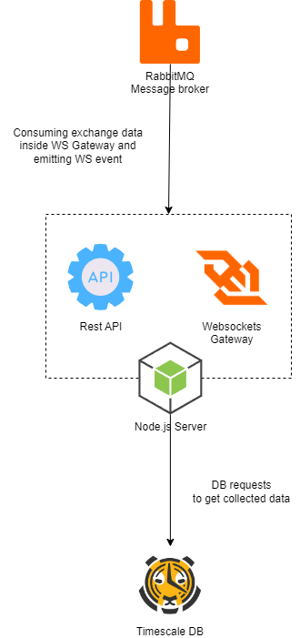

# API Gateway

## Table of Contents

1. [Introduction](#introduction)
2. [Real-Time Data Delivery](#real-time-data-delivery)
3. [Scalability](#rest-api-handling)
4. [User Experience](#user-experience)

## Introduction
The API Gateway in the CCDB Application architecture functions as a sophisticated Backend API Server, meticulously handling REST API requests. It serves as a conduit for efficiently retrieving data from TimescaleDB and is equipped with the capability to broadcast real-time updates to clients via WebSocket events. This capability positions it as an indispensable link in the communication chain of the system.

## Real-Time Data Delivery
- **WebSocket Events**: The API Gateway harnesses WebSocket technology to push updates to clients in real-time, which is vital for applications requiring timely data, such as live trading platforms and market analysis tools.

## REST API Handling
- **Data Retrieval**: Leveraging the power of TimescaleDB, the API Gateway efficiently processes REST API requests, ensuring quick access to time-series data and related analytics.
- **Request Management**: It manages a high volume of simultaneous data requests, maintaining a balance between quick data access and system performance without overloading the backend infrastructure.

## User Experience
- **Unified Interface**: By providing a single, unified API endpoint, the Gateway simplifies client interaction with the backend services, making the system more accessible and user-friendly.
- **Error Handling**: It implements standardized error handling, which ensures that any issues are communicated clearly and consistently to the client, aiding in troubleshooting and improving the overall user experience.

In summary, the API Gateway, equipped with RESTful interfaces and WebSocket communication, is a critical component that ensures efficient data flow and real-time responsiveness, enhancing the user's ability to make timely decisions based on the data provided by the CCDB Application.

---

 🔵 [Back to overview doc file](./overview.md)

 🟣 [Back to main doc file](../../README.md)
