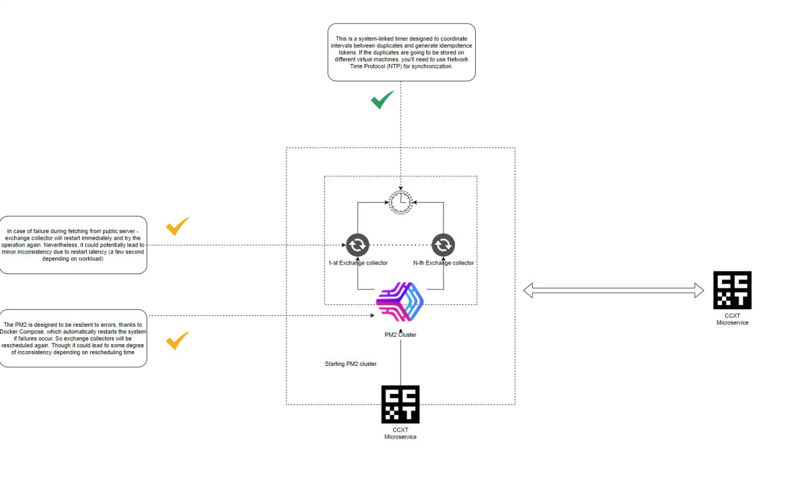

# Exchange Data Collectors

## Table of Contents

1. [Overview](#overview)
2. [Functionality](#functionality)
3. [Design](#design)
4. [Integration with RabbitMQ](#integration-with-rabbitmq)

## Overview
Exchange Data Collectors are integral components of the CCDB Application designed to interface with cryptocurrency exchange APIs. They are simple, lightweight processes that operate at scheduled intervals, which are meticulously aligned with the rate limits imposed by each exchange's API. Their primary responsibilities are two-fold: retrieving data specific to their designated data types and forwarding this data to the application's messaging system, RabbitMQ.

## Functionality
- **Data Fetching**: Each collector is tailored to fetch a particular type of data, such as order book snapshots, trades, tickers, candlestick charts, and exchange rates. This targeted approach ensures that the collectors remain efficient and focused, reducing overhead and the likelihood of encountering rate limit issues.

- **Rate Limit Compliance**: The collectors are programmed to respect the rate limits of the APIs they interact with. By adhering to these limits, the collectors avoid triggering any rate-limiting mechanisms that could lead to IP bans or data blackouts, ensuring a constant and reliable data stream.

- **Data Transmission**: Upon successful retrieval of data, collectors immediately publish the information to RabbitMQ. This message broker then handles the asynchronous delivery of data to the subsequent processing stages within the application.

## Design
- **Scalability**: Collectors are designed to be easily scalable. New instances can be deployed to accommodate additional data sources or to increase the frequency of data collection as needed.

- **Resilience**: Each collector operates independently, ensuring that the failure of one does not impact the others. This design enhances the overall robustness of the data collection layer.

- **Simplicity**: By limiting the functionality to data fetching and transmission, the collectors are kept simple and maintainable. This simplicity also facilitates quick updates or replacements should an exchange API undergo changes.

## Integration with RabbitMQ
- **Decoupling**: RabbitMQ serves as a decoupling layer between data collection and processing, allowing collectors to operate independently of the state or performance of the processing layers.

- **Reliability**: With RabbitMQ, messages are guaranteed to be delivered, even if a processing service is temporarily unavailable. This reliability is crucial for maintaining data integrity and consistency.

- **Efficient Processing**: By utilizing RabbitMQ, the system can implement various processing strategies such as load balancing and message prioritization, thereby optimizing resource utilization and response times.

In summary, Exchange Data Collectors are pivotal in ensuring that the CCDB Application receives timely and accurate market data, which is crucial for the application's data-driven services. Their design is a testament to the system's commitment to reliability, efficiency, and scalability.

---

 🔵 [Back to overview doc file](./overview.md)

 🟣 [Back to main doc file](../../README.md)
 