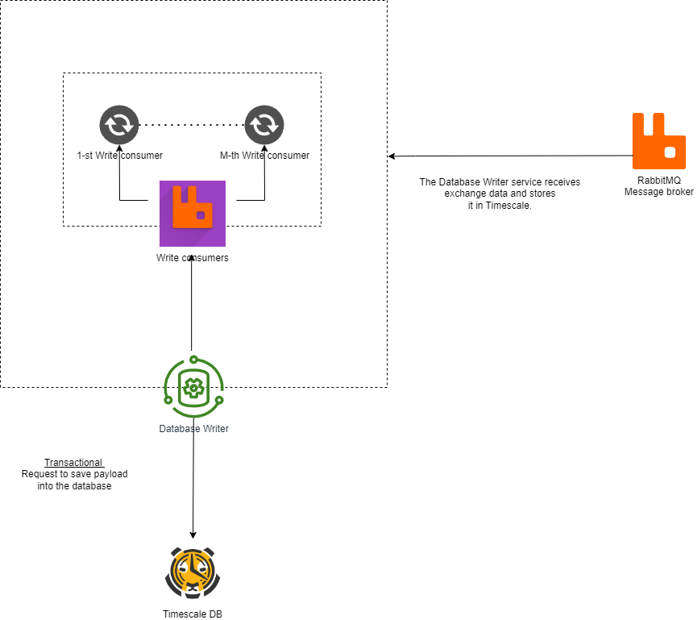

# Database Writer Microservice

## Table of Contents

1. [Purpose](#purpose)
2. [Operation](#operation)
3. [Design and Compatibility](#design-and-compatibility)
4. [Data Validation](#data-validation)
5. [Ensuring Data Quality and Storage Efficiency](#ensuring-data-quality-and-storage-efficiency)
6. [Role in the Ecosystem](#role-in-the-ecosystem)

## Purpose

The Database Writer microservice is a pivotal component of our system's architecture, tasked with the crucial role of data archival. Its core function is to maintain a vigilant watch over the message queues, capturing and processing the influx of messages dispatched by the Exchange Data Collectors.

## Operation

This microservice is continuously operating, listening for incoming data. Once data arrives, it executes a series of processing steps to ensure the incoming data payloads are correctly formatted and valid before they are committed to the database. This constant vigilance and processing ensure the system's data integrity and availability are maintained.

## Design and Compatibility

The microservice is architecturally designed to be flexible, accommodating the addition of collector replica sets which enhance the robustness of the data collection mechanism. This design not only ensures consistent data flow into the system but also contributes to the reduction of data redundancy, which is critical for maintaining a lean and efficient storage strategy.

## Data Validation

Before data is stored, the Database Writer microservice performs a thorough validation of the payload. It scrutinizes metadata fields including "intervalStart," "intervalEnd," and "marketId." This meticulous inspection serves to confirm that each record adheres to our stringent criteria for relevance and accuracy.

-   **"intervalStart" and "intervalEnd"**: These fields are checked to confirm that the data corresponds to the correct and intended time frame, an essential factor for time-series data analysis.
-   **"marketId"**: This field is verified to ensure that the data is categorized under the correct market identifier, which is crucial for maintaining organized and searchable records.

## Ensuring Data Quality and Storage Efficiency

Through its validation process, the Database Writer microservice guarantees that only data meeting our exact standards is preserved. This selective storage practice significantly enhances the quality of the data stored and optimizes the use of storage resources.

## Role in the Ecosystem

As a testament to its functionality, the Database Writer microservice is not just a component; it is the keystone of our data archival strategy. It embodies our commitment to precision and reliability and is a critical link in the chain of our architectural ecosystem, ensuring that the data lifecycle from collection to archival is seamless and efficient.

---

🔵 [Back to overview doc file](./overview.md)

🟣 [Back to main doc file](../../README.md)
