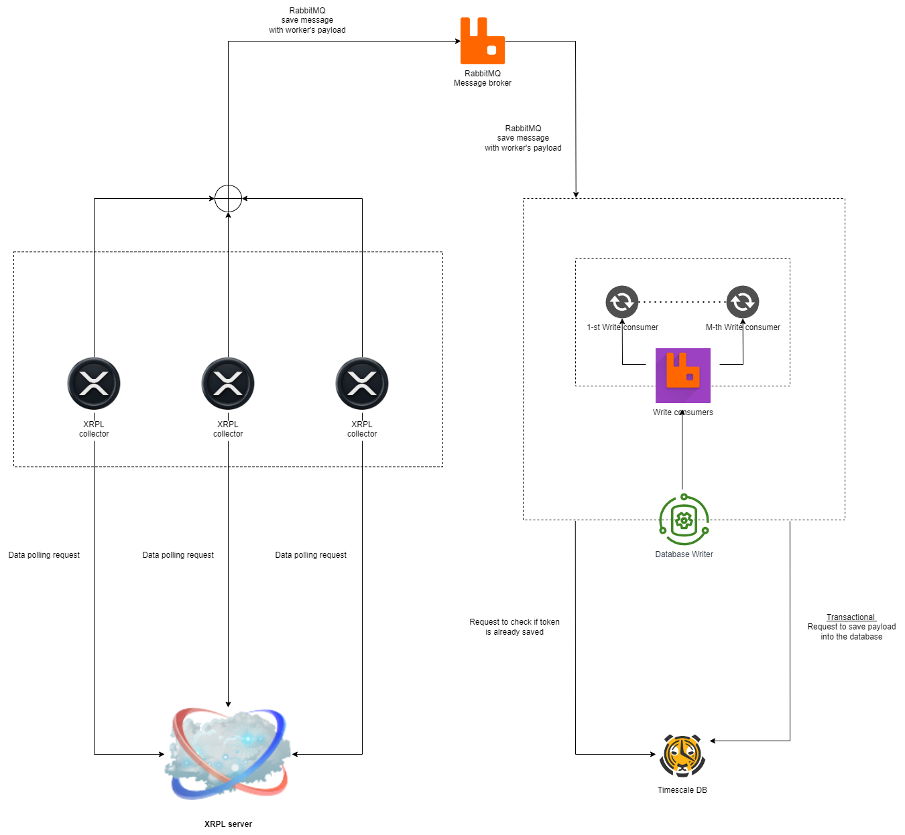

# Fault Tolerance

## Table of Contents

1. [Resilience Through Redundancy](#resilience-through-redundancy)
2. [Replica Sets for Collectors](#replica-sets-for-collectors)
3. [Integration with Database Writer](#integration-with-database-writer)
4. [System-Wide Fault Tolerance](#system-wide-fault-tolerance)
4. [Conclusion](#conclusion)

## Resilience Through Redundancy
Fault tolerance within the CCDB Application is a paramount feature, ensuring that the system is capable of maintaining continuous operations even in the face of individual component failures. This is achieved through the implementation of operational redundancy, particularly within the data collection layer of the architecture.

## Replica Sets for Collectors
- **Replica Sets**: The system utilizes replica sets for collectors, which allows for multiple instances of a single collector to run concurrently. These instances can be distributed across different machines, providing both load distribution and redundancy.
- **Collector Redundancy**: By running these collector replicas, the system ensures that if one instance fails, others can continue to operate without interruption, thereby enhancing the fault tolerance of the data collection process.

## Integration with Database Writer
- **Metadata Fields**: The Database Writer microservice is designed to recognize and utilize metadata fields attached to each record. These metadata fields include unique identifiers that act as idempotency tokens, ensuring that even if data is collected multiple times due to collector redundancy, it is not duplicated in the database.
- **Preventing Data Redundancy**: This idempotency mechanism is crucial for preventing data redundancy, as it allows the system to understand whether a particular piece of data has already been processed and stored.

## System-Wide Fault Tolerance
- **Data Processing**: In addition to collection, fault tolerance is also embedded in the data processing stages. The system is designed to handle errors gracefully, ensuring that data integrity is maintained even when anomalies are detected during processing.
- **Infrastructure**: The infrastructure itself is built with redundancy in mind, with critical components such as databases and load balancers set up in high-availability configurations to prevent single points of failure.

## Conclusion
The fault tolerance strategy of the CCDB Application, particularly within its data collection and processing layers, exemplifies a commitment to resilience and reliability. The careful orchestration of replica sets, coupled with intelligent data management by the Database Writer, ensures that the system can withstand failures without compromising data integrity or operational continuity.

---

 🔵 [Back to overview doc file](./overview.md)

 🟣 [Back to main doc file](../../README.md)
