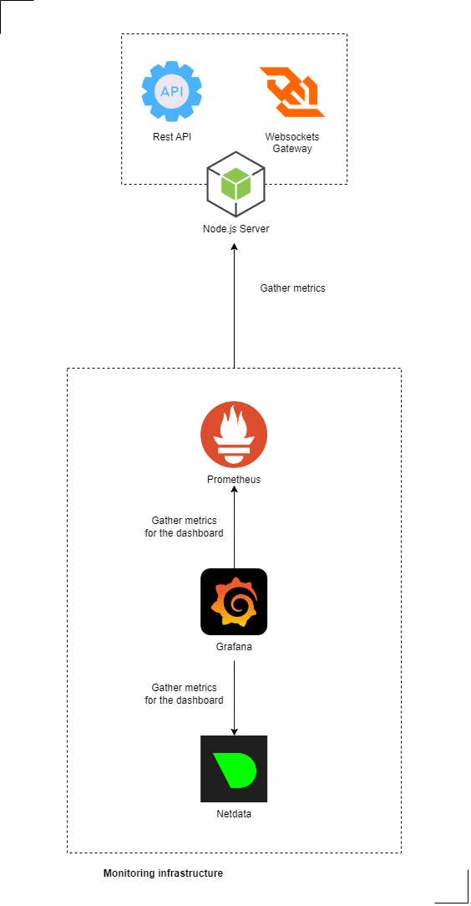

# Monitoring

## Table of Contents

1. [Comprehensive System Monitoring](#comprehensive-system-monitoring)
2. [Real-Time Analytics with Netdata](#real-time-analytics-with-netdata)
3. [Metrics Collection via Prometheus](#metrics-collection-via-prometheus)
4. [Data Visualization with Grafana](#data-visualization-with-grafana)
5. [Conclusion](#conclusion)

## Comprehensive System Monitoring

Monitoring within the CCDB Application is an essential aspect that focuses on maintaining optimal performance and preemptively identifying potential issues. Our comprehensive monitoring strategy is designed to oversee all aspects of the application, from hardware health to application performance metrics.

## Real-Time Analytics with Netdata

-   **Cloud-Based Monitoring**: Netdata is implemented for cloud-based monitoring, focusing on real-time hardware and resource analytics. This tool provides invaluable insights into the performance of our physical and virtual infrastructure.
-   **System Health Insights**: It offers detailed visualizations and alerts for system health, ensuring that any hardware-related issues are identified and addressed promptly.

## Metrics Collection via Prometheus

-   **Metrics Aggregation**: Prometheus plays a vital role in aggregating system and application metrics. It is configured to track key indicators such as uptime percentages and the frequency of failed transactions.
-   **Targeted Monitoring**: The metrics collected are tailored to provide deep insights into both the overall system health and individual components, allowing for targeted monitoring and maintenance efforts.

## Data Visualization with Grafana

-   **Intuitive Dashboards**: Grafana is used to transform the collected data into intuitive and interactive dashboards. These dashboards present a real-time overview of system health and performance.
-   **Customizable Visualizations**: Grafana's flexibility allows us to customize the visualizations to suit our specific monitoring needs, making it easier to interpret the large volumes of data generated.

## Conclusion

The monitoring framework of the CCDB Application, encompassing Netdata, Prometheus, and Grafana, establishes a robust system for tracking, analyzing, and visualizing performance metrics. This integrated approach ensures that we can proactively manage system health, optimize performance, and quickly respond to emerging issues, maintaining the reliability and efficiency of our application.

---

🔵 [Back to overview doc file](./overview.md)

🟣 [Back to main doc file](../../README.md)
