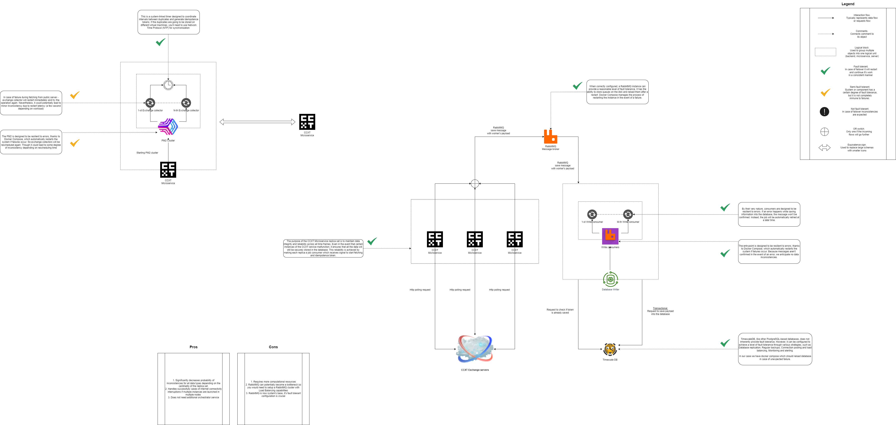

# CCDB Application Architecture

## Table of Contents

1. [Introduction](#introduction)
2. [Exchange Data Collectors](#exchange-data-collectors)
3. [Database Writer Microservice](#database-writer-microservice)
4. [TimescaleDB](#timescaledb)
5. [API Gateway](#api-gateway)
6. [Continuous Integration and Deployment](#continuous-integration-and-deployment)
7. [Scalability](#scalability)

---

## Introduction

The CCDB Application's architecture is constructed to facilitate efficient data collection, processing, and storage. Aimed at seamless integration with cryptocurrency exchanges and blockchain nodes, it ensures high availability and fault tolerance while catering to the demands of scalability and security.

## Exchange Data Collectors

Exchange Data Collectors are specialized components that interface with cryptocurrency exchange APIs to fetch market data. This part of the document would cover their design and how they ensure data consistency and reliability.

 🟢 [Details](./collectors.md)

## Database Writer Microservice

Here, we describe the functionality of the Database Writer Microservice, which is responsible for writing data into the database. It handles the ingestion of data from various sources and ensures its proper storage.

 🟢 [Details](./database_writer.md)

## TimescaleDB

TimescaleDB is utilized as a high-performance data storage solution, optimized for time-series data. This section will explore its role in storing and retrieving large volumes of data with efficiency.

 🟢 [Details](./timescale.md)

## API Gateway

The API Gateway acts as the entry point for all requests to the CCDB Application. It routes requests to the appropriate microservices and acts as a layer of abstraction to enhance security, provide unified logging, and help with load balancing.

 🟢 [Details](./api_gateway.md)

## Continuous Integration and Deployment

This section details the CI/CD pipeline utilized by the CCDB Application. It outlines how code changes are automatically built, tested, and deployed, ensuring a consistent and reliable development lifecycle.

 🟢 [Details](./ci_cd.md)

## Fault Tolerance

Finally, the Scalability section discusses the strategies in place to ensure that the CCDB Application can handle growth in data volume, number of users, and transaction frequency without performance degradation.

 🟢 [Details](./scalability.md)

## Scalability

Finally, the Scalability section discusses the strategies in place to ensure that the CCDB Application can handle growth in data volume, number of users, and transaction frequency without performance degradation.

 🟢 [Details](./scalability.md)

---

 🟣 [Back to main doc file](../../README.md)
