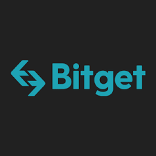
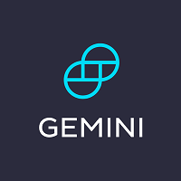
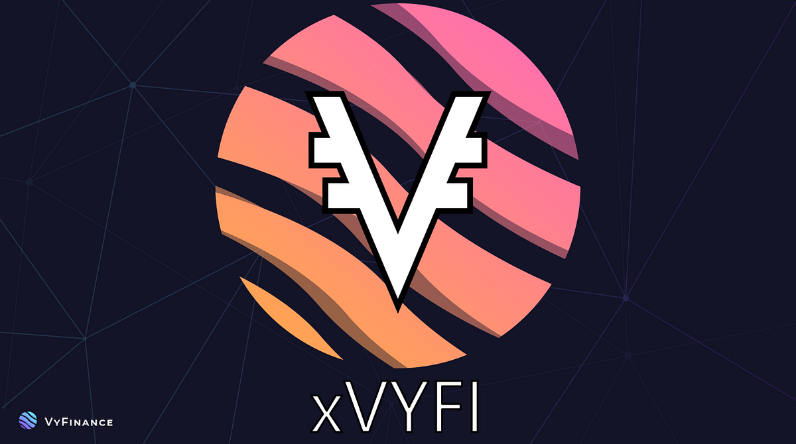
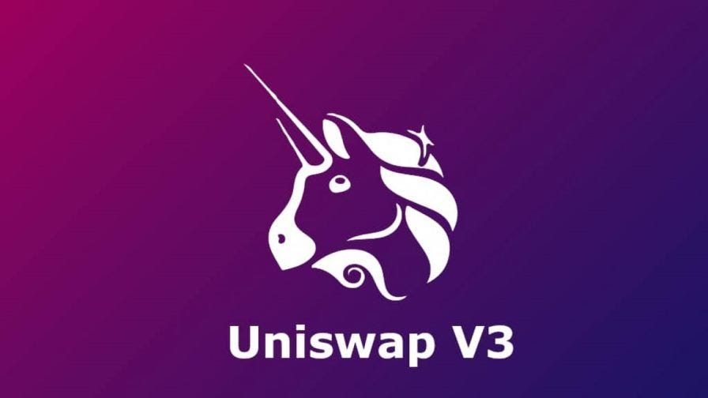
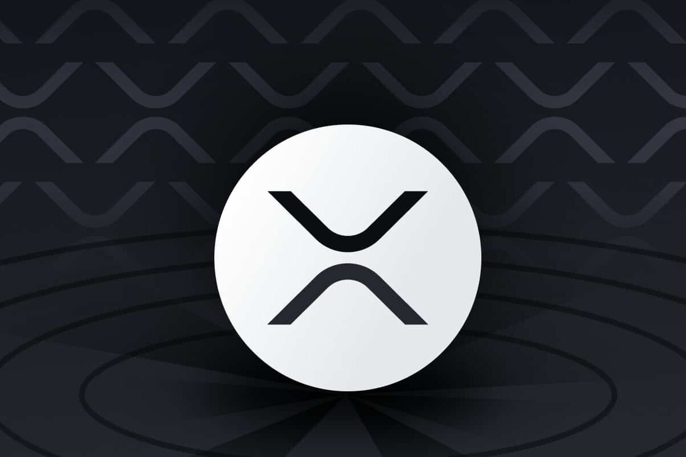

# Exchanges Integration Documentation

## Table of Contents

-   [CEX (CCXT)](#cex-ccxt)
    -   [CEX Introduction](#cex-introduction)
    -   [CEX Data Types Collected](#cex-data-types-collected)
    -   [CEX Integrations Table](#cex-integrations-table)
-   [DEX (UDEX)](#dex-udex)
    -   [UDEX Introduction](#udex-introduction)
    -   [UDEX Data Types Collected](#udex-data-types-collected)
    -   [UDEX Integrations Table](#udex-integrations-table)
-   [DEX (XRPL)](#dex-xrpl)
    -   [XRPL Introduction](#xrpl-introduction)
    -   [XRPL Data Types Collected](#xrpl-data-types-collected)
    -   [XRPL Integrations Table](#xrpl-integrations-table)

---

## CEX (CCXT)

### CEX Introduction

Centralized Exchanges (CEX) are platforms where cryptocurrencies and other digital assets can be traded in a controlled environment. The CCXT library is a powerful tool used for connecting and trading with various centralized exchanges through a unified API. This section details the integration with CEX platforms using CCXT, focusing on the data types collected from these exchanges.

### CEX Data Types Collected

-   **OrderBooks**: Provides a real-time snapshot of the order book for a specific trading pair, including information on buy and sell orders.
-   **Tickers**: Offers the latest trading statistics for a particular trading pair, such as the last trade price, 24-hour volume, and price change.
-   **Trades**: Contains data on individual trades that have occurred, including price, volume, and time.
-   **CandleSticks**: Utilized for charting and analysis, this data represents market movements over a specified period, showing the open, high, low, and close prices.

### CEX Integrations Table

| Exchange                                                                                     | Reference                             |
| :------------------------------------------------------------------------------------------- | :------------------------------------ |
|        | [Binance](https://www.binance.com/)   |
|    | [Bitfinex](https://www.bitfinex.com/) |
|          | [Bitget](https://www.bitget.com/)     |
|      | [Bitstamp](https://www.bitstamp.net/) |
|            | [Bybit](https://www.bybit.com/)       |
|   | [Gate.io](https://www.gate.io/)       |
|          | [Gemini](https://www.gemini.com/)     |
|  | [Kraken](https://www.kraken.com/)     |
|          | [Kucoin](https://www.kucoin.com/)     |
|                | [OKX](https://www.okx.com/)           |

## DEX (UDEX)

### UDEX Introduction

Decentralized Exchanges (DEX) operate without a central authority, facilitating direct peer-to-peer cryptocurrency transactions. UDEX represents a class of decentralized exchanges. This section outlines the integration with DEX platforms of the UDEX type, specifically focusing on the type of data exchanged.

### UDEX Data Types Collected

-   **ExchangeRates**: Provides information on the current exchange rates between different cryptocurrencies available on UDEX, allowing users to understand the value of their trades.

### UDEX Integrations Table

| Exchange                                                                                                    | Blockchain | Reference                                      |
| :---------------------------------------------------------------------------------------------------------- | :--------- | :--------------------------------------------- |
|               | Cardano    | [MinSwap](https://minswap.org/)                |
|         | Cardano    | [MuesliSwap](https://muesliswap.com/)          |
|         | Cardano    | [SundaeSwap](https://sundaeswap.finance/)      |
|          | Cardano    | [VyFinance](https://vyfi.io/)                  |
|         | Cardano    | [WingRiders](https://wingriders.com/)          |
|          | Ethereum   | [SushiSwap](https://sushi.com/)                |
|        | Ethereum   | [Uniswap V2](https://v2.info.uniswap.org/)     |
|        | Ethereum   | [Uniswap V3](https://uniswap.org/)             |
|                   | Tezos      | [Plenty](https://plentydefi.com/)              |
|  | Tezos      | [Quipuswap Stableswap](https://quipuswap.com/) |
|          | Tezos      | [Quipuswap v2](https://quipuswap.com/)         |

## DEX (XRPL)

### XRPL Introduction

The XRP Ledger (XRPL) is a decentralized cryptographic ledger powered by a network of peer-to-peer servers. It supports decentralized exchange features directly within its ledger. This section explains the integration with the decentralized exchange features of the XRPL, emphasizing the data type collected.

### XRPL Data Types Collected

-   **OrderBooks**: Similar to CEX, the XRPL's decentralized nature also allows for the collection of order book data, which includes buy and sell orders for trading pairs within the XRPL ecosystem.

### XRPL Integrations Table

| Exchange                                                                         | Reference                 |
| :------------------------------------------------------------------------------- | :------------------------ |
|  | [XRPL](https://xrpl.org/) |

---

🟣 [Back to main doc file](../../README.md)
