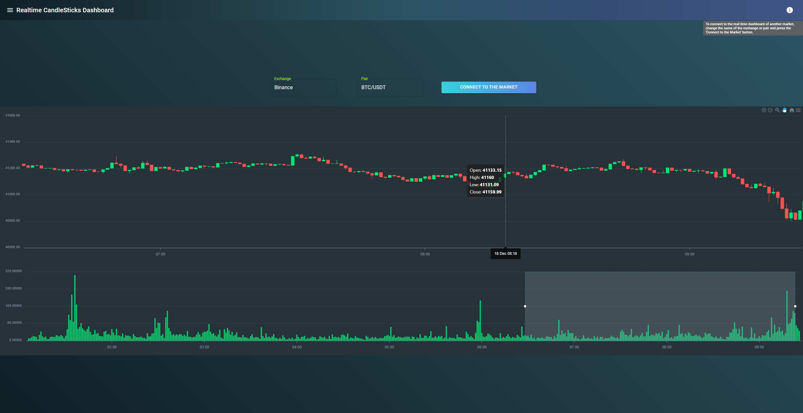
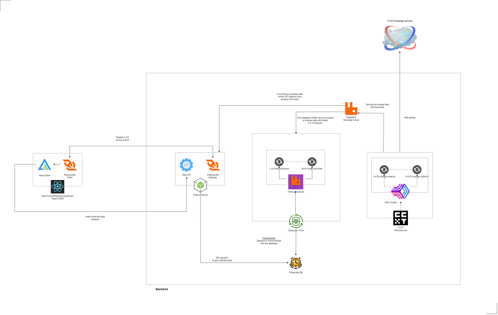

# **Use Case: Real-Time Streaming Dashboard via Websocket API**

## Table of Contents

-   [Scenario](#scenario)
-   [Target Pairs](#target-pairs)
-   [Features](#features)
-   [Implementation](#implementation)
-   [Live Instance](#live-instance)
-   [Codebase](#codebase)
-   [Construction of the Real-Time Dashboard](#construction-of-the-real-time-dashboard)
-   [Why ApexCharts](#why-apexcharts)

## Scenario

The objective is to develop a dashboard that displays **up-to-the-minute market data** for selected cryptocurrency pairs, leveraging the power of our WebSocket API for real-time data streaming.

## Target Pairs

The dashboard will feature real-time updates for the following pairs:

-   `ADA-BTC` (Ada to bitcoin)
-   `XRP-BTC` (XRP to bitcoin)
-   `XTZ-BTC` (Tez to bitcoin)
-   `ETH-BTC` (Ether to bitcoin)
-   `BTC-USD` (bitcoin to US Dollar)

## Features

1. **Real-Time Data Streaming:** Instantaneous updates as our server emits pricing events, ensuring a live feed with no need for manual refresh.
2. **Multiple Data Types Display:** Showcasing Order Book depths, latest Trades, Ticker information, Candlestick charts, and Exchange Rates.

3. **Customizable Views:** Users can select which pairs to display and customize settings for each data type.

4. **High Performance and Scalability:** Optimized for handling high-frequency data with minimal latency.

5. **User-Friendly Interface:** Easy-to-navigate design for efficient monitoring of different pairs and data types.

## Implementation

Utilizing web technologies compatible with WebSocket connections, the dashboard will subscribe to our server's feeds for the specified pairs, updating the display in real-time as new data arrives.

## Live Instance

-   🚀 [Realtime Dashboard](https://min.ccdb.waexservices.com/realtime-dashboard/)

## Codebase

-   🚀 [WolframRealTime-Dashoard](https://github.com/WolframBlockchainLabs/WolframRealTime-Dashoard)

## Construction of the Real-Time Dashboard

The dashboard is engineered using a blend of cutting-edge libraries and frameworks to provide a seamless real-time data visualization experience. Below is an outline of the key components and the rationale behind their selection:

### Architecture Diagram

### Chart Rendering with ApexCharts

-   **ApexCharts Library:** For rendering the charts, we utilize the ApexCharts library. ApexCharts is chosen for its interactive and responsive charting capabilities which are crucial for visualizing live data streams.

### Design Framework

-   **Material UI:** The overall design is crafted using Material UI, a comprehensive React UI framework that implements Material Design principles, providing an intuitive and cohesive user interface.

### Data Handling and WebSocket Integration

-   **Custom React Hook with Socket.IO:** A custom React hook coupled with Socket.IO handles fetching historical data from TimescaleDB and establishes a WebSocket connection for continuous, real-time updates.

### Dynamic Market Connection

-   **Market Connection Flexibility:** Users can dynamically connect to different markets by changing the exchange or pair name and clicking the 'Connect to the Market' button, triggering the hook to reexecute with new arguments.

## Why ApexCharts

In the development of our real-time dashboard, we conducted an extensive comparison of various charting libraries and tools. The decision to utilize ApexCharts was made after evaluating the following criteria against other potential solutions like Grafana, Apache ECharts, and other charting libraries:

### Integration and Real-Time Control

-   **ApexCharts with Socket.IO and React.js**: Offers a robust combination for real-time data streaming. The use of Socket.IO provides a powerful interface for WebSocket communication, while React.js allows for dynamic state management and seamless UI updates.

-   **Grafana**: Primarily a metrics dashboard and graph composer, Grafana is less suited for real-time, event-driven updates and requires additional plugins for WebSocket support.

-   **Apache ECharts**: While highly customizable, integrating real-time WebSocket data requires a more complex setup and does not offer as straightforward an integration with React.js as ApexCharts does.

### Customizability and Interactivity

-   **ApexCharts**: Known for its wide range of interactive and customizable charts that can be easily styled and configured within React.js applications.

-   **Apache ECharts**: Offers a high degree of customizability but with a steeper learning curve for styling and a less interactive experience compared to ApexCharts.

-   **Other Charting Libraries**: Many other libraries were considered, but they either lacked the ease of integration with React.js or did not provide the advanced interactive features that ApexCharts offers.

### Performance and Scalability

-   **ApexCharts**: Excels in handling high-frequency updates with minimal impact on performance, crucial for real-time trading dashboards.

-   **Grafana**: While capable of handling large datasets, it is optimized for time-series data monitoring rather than high-frequency trading data.

-   **Apache ECharts**: Can struggle with performance under high-frequency updates, which can be a limiting factor for real-time dashboards.

### User Experience

-   **ApexCharts**: Delivers a smooth user experience with responsive and interactive charts, enhancing the data visualization for end-users.

-   **Grafana**: Has a more administrative interface which may not be as user-friendly for traders and general users.

-   **Apache ECharts**: Provides a good user experience but requires more customization to reach the same level of interactivity and responsiveness as ApexCharts.

### Data Manipulation and Transformation

-   **ApexCharts**: Simplifies the process of data manipulation and transformation within the charts, an essential feature for real-time analytics.

-   **Grafana**: Lacks native support for complex data transformations, often requiring additional tools or manual processing.

-   **Apache ECharts**: Supports data manipulation but can be intricate, especially when dealing with live data streams.

In summary, ApexCharts was chosen for its superior integration with React.js and Socket.IO, offering a balance of performance, customizability, and user experience that other solutions did not match. This choice provides us with the flexibility and functionality required to build an efficient and responsive real-time trading dashboard.

---

🟣 [Back to main doc file](../../README.md)
