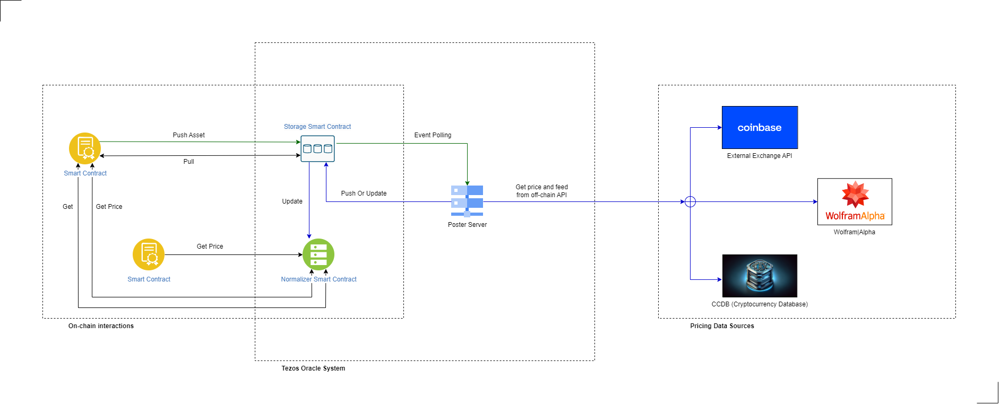

# **Use Case: Tezos Oracle for Accurate Pricing Feeds**

## Overview

This documentation presents the use case for a Tezos-based oracle that provides reliable pricing feeds crucial for decentralized finance (DeFi) applications. The oracle leverages blockchain's transparency and immutability to offer up-to-date asset prices, integrating with smart contracts to facilitate automated and trustless executions of financial operations.

## Table of Contents

- [Introduction](#introduction)
- [Oracle Design](#oracle-design)
- [Data Sources and Reliability](#data-sources-and-reliability)
- [Features](#features)
- [Implementation Details](#implementation-details)
- [System Architecture](#system-architecture)
- [Integrating with Tezos Smart Contracts](#integrating-with-tezos-smart-contracts)
- [Advantages of Our Tezos Oracle](#advantages-of-our-tezos-oracle)

## Introduction

In the burgeoning field of DeFi, the accuracy of pricing oracles is paramount. Our Tezos Oracle serves as a critical component, providing DeFi platforms with precise and tamper-proof price feeds for a variety of assets.

## Oracle Design

Our Tezos Oracle is designed with an emphasis on security, accuracy, and latency. It is a decentralized system that pulls pricing data from various authoritative sources and feeds it into the Tezos blockchain, enabling smart contracts to operate with the most recent and accurate prices.

## Data Sources and Reliability

### Key Components:

- **External Exchange APIs**: Data is sourced from established cryptocurrency exchanges like Coinbase, ensuring market-representative prices.
- **Financial Data Providers**: We incorporate pricing data from renowned financial data services, adding another layer of price verification.
- **Decentralized Data Aggregators**: Utilization of decentralized platforms ensures that the oracle remains resistant to single points of failure.

### Data Accuracy:

- **Cross-verification**: Prices are cross-verified across different platforms to prevent discrepancies and manipulation.
- **Timely Updates**: The system is designed for rapid polling and updating to reflect real-time market movements.

## Features

1. **Multi-Source Data Aggregation**: Ensures robustness and accuracy by combining multiple data points.
2. **Decentralized Verification**: Utilizes a network of nodes for data validation, mitigating the risks of centralized control.
3. **Smart Contract Compatibility**: Designed for seamless integration with Tezos smart contracts.
4. **High Availability**: Built with fault tolerance in mind to provide continuous service.
5. **Scalable Infrastructure**: Capable of expanding to accommodate a growing number of data sources and smart contracts.

## Implementation Details

The Tezos Oracle is implemented with a series of interconnected components, each responsible for specific tasks within the data retrieval and distribution process. A combination of on-chain and off-chain mechanisms ensures data integrity and delivery.

## System Architecture

- **Smart Contracts**: Act as the on-chain endpoints for data consumption.
- **Storage Smart Contract**: Stores the latest verified prices on the blockchain.
- **Normalizer Smart Contract**: Aggregates and normalizes data from different sources to provide a standardized output.
- **Poster Server**: An off-chain server that polls data from external sources and pushes it to the smart contracts.
- **Event Polling**: Monitors data sources and triggers updates to the Poster Server.

## Integrating with Tezos Smart Contracts

Smart contracts on the Tezos blockchain can retrieve the latest asset prices by interacting with the oracle's Storage Smart Contract. This allows for the execution of financial logic based on the current market prices of various cryptocurrencies and other assets.

## Advantages of Our Tezos Oracle

### Enhanced Security:

- **Decentralized Nodes**: Distribution of data sourcing and validation across multiple nodes to prevent single points of failure and manipulation.

### Performance:

- **Optimized Data Retrieval**: System design prioritizes low latency to maintain high performance and real-time data provision.

### Reliability:

- **Robust Data Sources**: Selection of premium and reliable data sources to ensure continuous and accurate data availability.

In summary, our Tezos Oracle system is architected to provide a critical service to the DeFi ecosystem, enabling accurate, secure, and decentralized price feeds that smart contracts can rely on for executing financial operations.

---

 🟣 [Back to main doc file](../../README.md)
