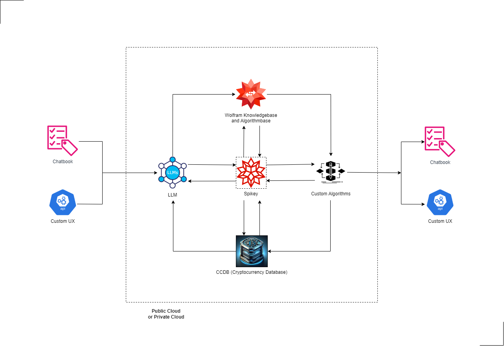
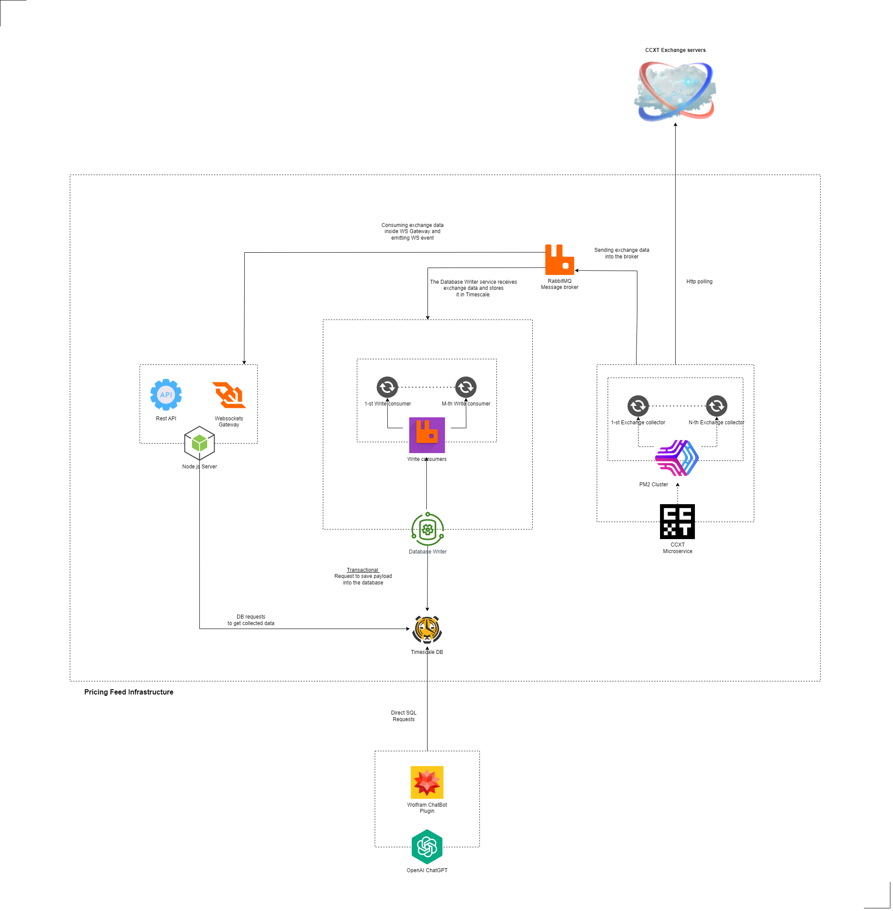
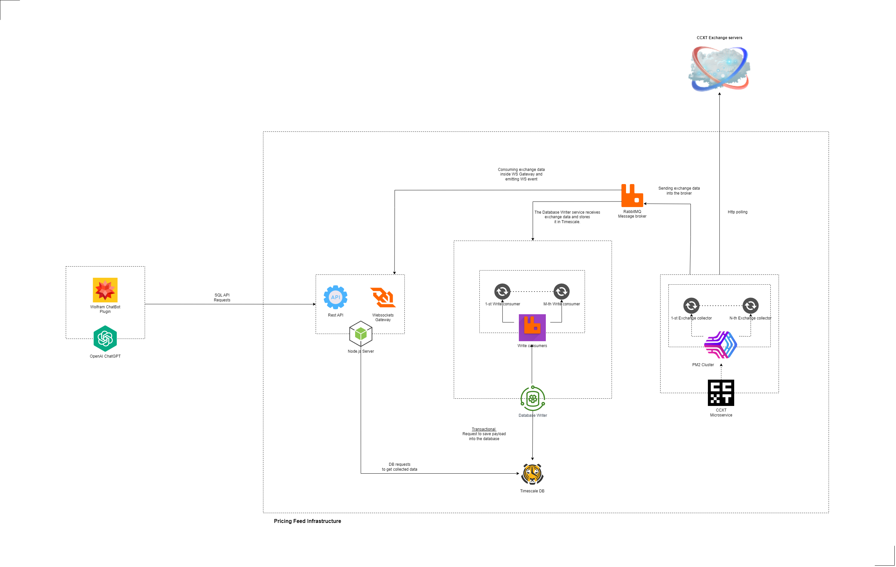

# **Use Case: Wolfram ChatBot Insights**

## Overview

This use case describes a ChatGPT plugin designed to interface with a TimescaleDB database using natural language processing. The plugin enables users to query and interact with the data through conversational input. Below, we evaluate two proposed methods for integrating this plugin with our project's infrastructure.

## Table of Contents

- [Introduction](#introduction)
- [Plugin Capabilities](#plugin-capabilities)
- [Integration Options](#integration-options)
  - [Option 1: Private Network Exposure](#option-1-private-network-exposure)
  - [Option 2: Microservice within CCDB](#option-2-microservice-within-ccdb)
- [Comparative Analysis](#comparative-analysis)
- [Conclusion](#conclusion)

## Introduction

The Wolfram ChatGPT plugin is tasked with providing an intuitive and natural interface for querying a TimescaleDB database, allowing users to interact with data without the need for structured query language knowledge.

## Plugin Capabilities

- **Natural Language Queries**: Users can ask questions or make requests using natural language.
- **Data Retrieval**: The plugin scans the database, retrieving information as per the user's request.
- **Interactive Responses**: Provides conversational feedback based on the data retrieved from the database.

## Integration Options

### Option 1: Private Network Exposure

#### Proposal
- Expose the TimescaleDB port within a private network.
- Create a read-only user for specific tables.
- Enforce query execution time limits.

#### Benefits
- Simplified database setup.
- Enhanced security within a controlled environment.

#### Trade-offs
- Limited management capabilities.
- Complexity in setting up and maintaining a private network.
- Manual security management may increase the risk of breaches.
- TLS setup for database connections may be error-prone.

### Option 2: Microservice within CCDB

#### Proposal
- Develop a Node.js microservice that manages SQL communication.
- Use special tokens for API access, controlled by administrators or via a paid plan.
- Create a read-only user for specific tables.
- Enforce query execution time limits.

#### Benefits
- Full programmatic control with complex access verification.
- Improved session management and security features like throttling and rate limits.
- No need for a private network setup.
- Security is managed systematically with automated permission tests.
- TLS management is integrated within the existing NGINX proxy architecture.

#### Trade-offs
- Increased development time.
- Dependency on the integration of user and access token management systems.

## Comparative Analysis

Option 1 offers a straightforward approach with tight security controls by virtue of network isolation. However, it lacks flexibility and poses potential difficulties in setup and maintenance.

Option 2 presents a more robust and scalable solution, incorporating a microservice that acts as an intermediary between the ChatGPT plugin and the database. This option provides more sophisticated session management and security measures but requires a greater initial investment in development and system integration.

## Conclusion

In considering both options for integrating the ChatGPT plugin with our infrastructure, it is apparent that each has its strengths and limitations. The decision should align with our long-term strategic objectives, taking into account factors such as security, scalability, and maintainability. The chosen integration method should provide a seamless user experience while ensuring the integrity and security of our database systems.

---

 🟣 [Back to main doc file](../../README.md)
